
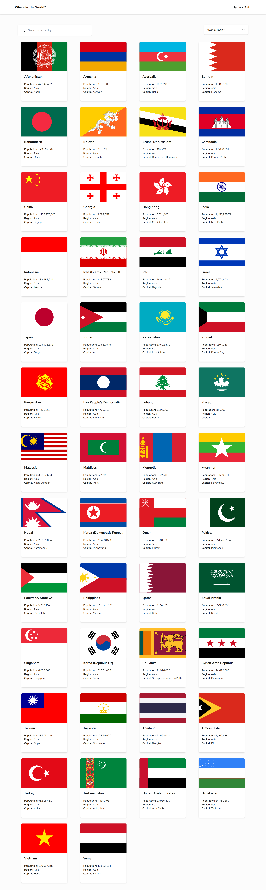
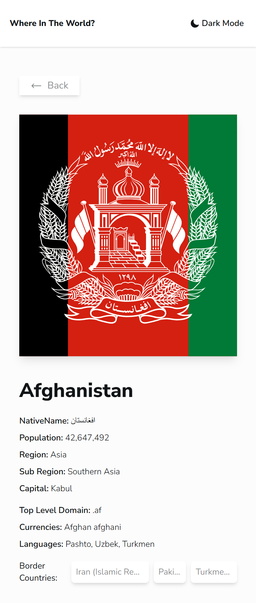
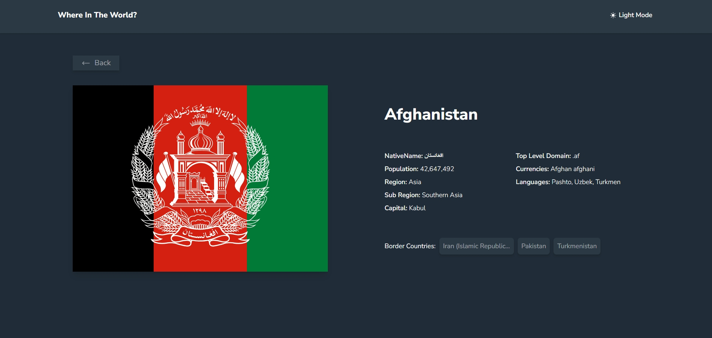

# REST Countries App

A countries explorer built as a [Frontend Mentor](https://www.frontendmentor.io/) challenge. Browse every country, search by name, filter by region, and open a details page for each one. Fully responsive, with a persistent light/dark theme.

**Live demo:** https://candid-kitten-79407e.netlify.app

## Screenshots

| Page    | Mobile                                | Desktop                                 |
| ------- | ------------------------------------- | --------------------------------------- |
| Main    |     |      |
| Country |  |  |

## Built With

- [React](https://react.dev/) and [React Router](https://reactrouter.com/)
- TypeScript
- [Vite](https://vite.dev/)
- [Tailwind CSS v4](https://tailwindcss.com/), with theme colors defined as CSS variables
- React Context API for shared country data

## Features

- Responsive country grid (1 to 4 columns depending on screen size)
- Search by country name (case-insensitive) combined with a region filter
- Search and region filter are saved in `localStorage`, so they survive a refresh
- Light/dark theme toggle, also saved in `localStorage`
- Country details page: native name, population, region, sub-region, capital, top-level domain, currencies, languages
- Border countries (up to three) that link to their own details pages
- Loading state, a "country not found" state and a 404 page

## How It Works

- Country data is loaded once from a local JSON file (`public/fetchData.json`) by a context provider and shared with every page.
- The filtered list on the home page is derived with `useMemo` from the full list and the current filter, instead of being stored as separate state.
- The details page derives three states (loading, not found, found) from the same data and the route parameter.
- Theming uses CSS variables that switch under a `light` / `dark` class on the root element.

## Getting Started

```bash
git clone https://github.com/Origin-B/rest-countries-app.git
cd rest-countries-app
npm install
npm run dev
```

| Command           | Description                  |
| ----------------- | ---------------------------- |
| `npm run dev`     | Start the development server |
| `npm run build`   | Build for production         |
| `npm run preview` | Preview the production build |
| `npm run lint`    | Lint the codebase            |

## Project Structure

```
src/
├── components/
│   ├── layout/   # Layout, Header (theme toggle)
│   ├── home/     # Filter, CountryCard
│   ├── shared/   # Paragraph, Spinner
│   └── icons/    # SVG icons
├── context/      # CountryProvider
├── pages/        # Home, Details, NotFound
└── type/         # TypeScript types
```

## What I'm Most Proud Of

The state design. All country data lives in one context, and everything else is derived from it: the filtered list on the home page and the loading / not-found / found states on the details page. That kept the app free of duplicated state and made the filter and theme easy to persist.

## What I'd Do Differently Next Time

- **Handle failed requests.** A failed fetch is only logged to the console, so the home and details pages would show "Loading..." forever. I would add an error state with a retry option.
- **Route by `alpha3Code` instead of `numericCode`.** Some countries may not have a numeric code, and border countries are already matched by alpha-3 code, so it would remove a lookup as well.
- **Add a "no results" message** when a search and filter combination matches nothing.
- **Improve accessibility.** The region dropdown items are clickable `<li>` elements that keyboard users cannot reach; a proper listbox (or a native `<select>`) with `aria-expanded` on the button would fix that.
- **Tighten the types.** The `setFilter` prop is typed as a plain function, but it is called with an updater function, and the filter state read from `localStorage` is untyped.

## Author

**Origin-B** - [GitHub](https://github.com/Origin-B)
